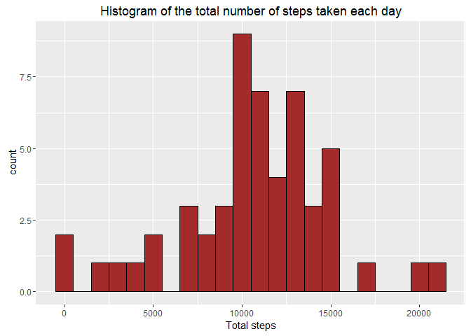
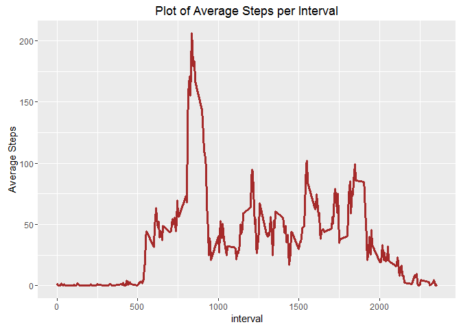
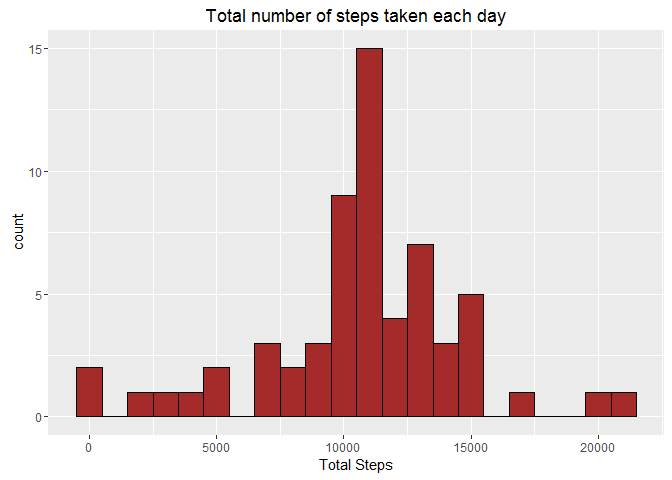
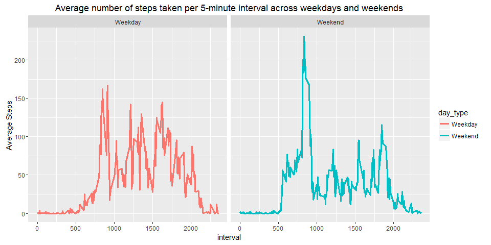

# Reproducible Research: Peer Assessment 1

## Loading and preprocessing the data

No preprocessing requried. colClasses used to define the classes for the 3 columns. i.e, steps, date and interval respectively


```r
activities <- read.csv("activity.csv", colClasses = c("numeric", "Date", "integer"))
```

## What is mean total number of steps taken per day?

Here, we remove NA entries from steps and then group data by date using group_by command then we use summarize to sum up the individual non NA entries to give the total sum for a given date.


```r
library(dplyr)
```

```
## 
## Attaching package: 'dplyr'
```

```
## The following objects are masked from 'package:stats':
## 
##     filter, lag
```

```
## The following objects are masked from 'package:base':
## 
##     intersect, setdiff, setequal, union
```

```r
steps <- activities %>% filter(!is.na(steps)) %>% group_by(date) %>% summarize(steps_total=sum(steps))
head(steps)
```

```
## Source: local data frame [6 x 2]
## 
##         date steps_total
##       (date)       (dbl)
## 1 2012-10-02         126
## 2 2012-10-03       11352
## 3 2012-10-04       12116
## 4 2012-10-05       13294
## 5 2012-10-06       15420
## 6 2012-10-07       11015
```

Histogram of the total number of steps taken each day

```r
library(ggplot2)
ggplot(data = steps, aes(steps_total)) + geom_histogram(fill="brown",col="black",binwidth = 1000) + xlab("Total steps") + ggtitle("Histogram of the total number of steps taken each day")
```



Mean and median number of steps taken each day

```r
head(steps)
```

```
## Source: local data frame [6 x 2]
## 
##         date steps_total
##       (date)       (dbl)
## 1 2012-10-02         126
## 2 2012-10-03       11352
## 3 2012-10-04       12116
## 4 2012-10-05       13294
## 5 2012-10-06       15420
## 6 2012-10-07       11015
```

```r
total_steps_mean <- mean(steps$steps_total,na.rm = TRUE)
total_steps_median <- median(steps$steps_total, na.rm=TRUE)
print(paste("Mean total number of steps taken per day is",total_steps_mean))
```

```
## [1] "Mean total number of steps taken per day is 10766.1886792453"
```

```r
print(paste("Median total number of steps taken per day is",total_steps_median))
```

```
## [1] "Median total number of steps taken per day is 10765"
```


## What is the average daily activity pattern?


```r
intervals <- activities %>% filter(!is.na(steps)) %>% group_by(interval) %>% summarise(average_steps = mean(steps))
head(intervals)
```

```
## Source: local data frame [6 x 2]
## 
##   interval average_steps
##      (int)         (dbl)
## 1        0     1.7169811
## 2        5     0.3396226
## 3       10     0.1320755
## 4       15     0.1509434
## 5       20     0.0754717
## 6       25     2.0943396
```

Plot of average steps per interval

```r
ggplot(data=intervals, aes(interval,average_steps)) + geom_line(col="brown",lwd=1.2) + ylab("Average Steps") + ggtitle("Plot of Average Steps per Interval")
```



The 5-minute interval that, on average, contains the maximum number of steps

```r
max_index <- which.max(intervals$average_steps)
max_interval <- intervals$interval[max_index]
max_value <- intervals$average_steps[max_index]
print(paste("Max Interval -> ",max_interval," ; Value -> ",max_value))
```

```
## [1] "Max Interval ->  835  ; Value ->  206.169811320755"
```

## Imputing missing values

Code to describe and show a strategy for imputing missing data

* Imputing the missing values by substituting the missing values by the average value across all dates for the interval.


```r
avg_intervals <- tapply(activities$steps, activities$interval, mean, na.rm=TRUE, simplify = TRUE)
steps_na <- is.na(activities$steps)
activities[steps_na,"steps"] <- avg_intervals[as.character(activities[steps_na,"interval"])]
head(activities)
```

```
##       steps       date interval
## 1 1.7169811 2012-10-01        0
## 2 0.3396226 2012-10-01        5
## 3 0.1320755 2012-10-01       10
## 4 0.1509434 2012-10-01       15
## 5 0.0754717 2012-10-01       20
## 6 2.0943396 2012-10-01       25
```

Histogram of the total number of steps taken each day after missing values are imputed


```r
total_steps <- activities %>% group_by(date) %>% summarise(steps_total = sum(steps))
ggplot(data=total_steps, aes(steps_total)) + geom_histogram(fill="brown",col="black",binwidth = 1000) + xlab("Total Steps") + ggtitle("Total number of steps taken each day")
```



## Are there differences in activity patterns between weekdays and weekends?

Panel plot comparing the average number of steps taken per 5-minute interval across weekdays and weekends


```r
weekends <- c("Saturday","Sunday")
weekday_bool <- weekdays(activities$date) %in% weekends
weekend_bool <- !weekday_bool
weekday_averages <- tapply(activities[weekday_bool,"steps"],activities[weekday_bool,"interval"],mean)
tb1 <- data.frame(interval=as.numeric(names(weekday_averages)), avg_steps=weekday_averages, day_type="Weekday")
weekend_averages <- tapply(activities[weekend_bool,"steps"],activities[weekend_bool,"interval"],mean)
tb2 <- data.frame(interval=as.numeric(names(weekend_averages)), avg_steps=weekend_averages, day_type="Weekend")
tb_combined <- rbind(tb1,tb2)
ggplot(data=tb_combined,aes(interval,avg_steps,color=day_type))+geom_line(lwd=1.1)+facet_grid(.~day_type) + ylab("Average Steps") + ggtitle("Average number of steps taken per 5-minute interval across weekdays and weekends")
```


